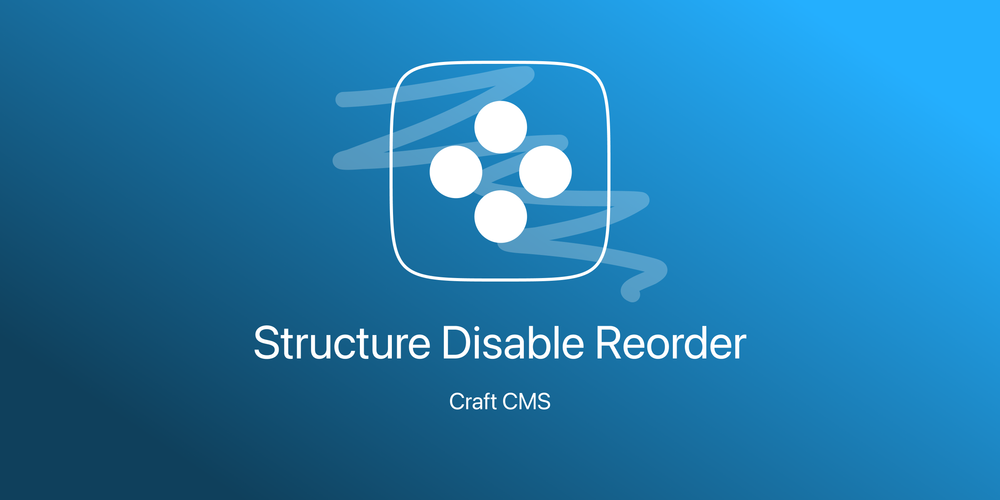
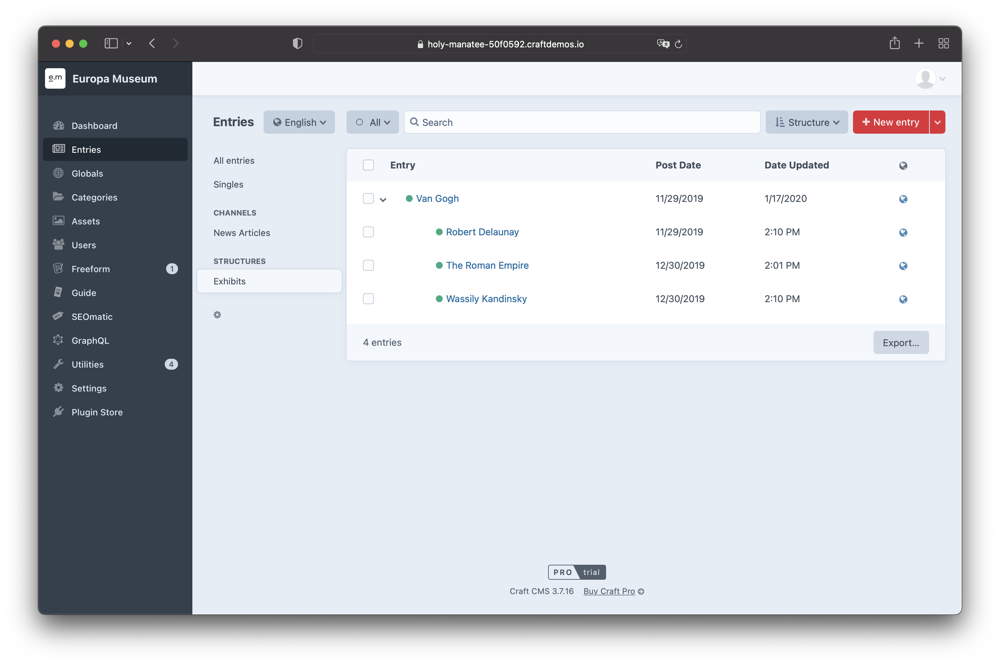

# Structure Disable Recorder for Craft CMS 3.x

This plugin prohibits moving entries in a structure. So you can only change the parent by using the entry edit page. That's it!

__Feature Requests are welcome!__

## Requirements

This plugin requires Craft CMS 3.0.0-beta.23 or later.

### Installation
To install this plugin, follow these steps:
1. Install with Composer via `composer require internetztube/craft-structure-disable-reorder`
2. Install plugin in the Craft Control Panel under Settings > Plugins

You can also install this plugin via the Plugin Store in the Craft Control Panel.

## Screenshots

Note: The icons with which you can normally move the entry are missing here.

# Issues
Please report any issues you find to the [Issues](https://github.com/internetztube/craft-structure-disable-reorder/issues) page.

Brought to you by [Frederic Koeberl](https://frederickoeberl.com/)
